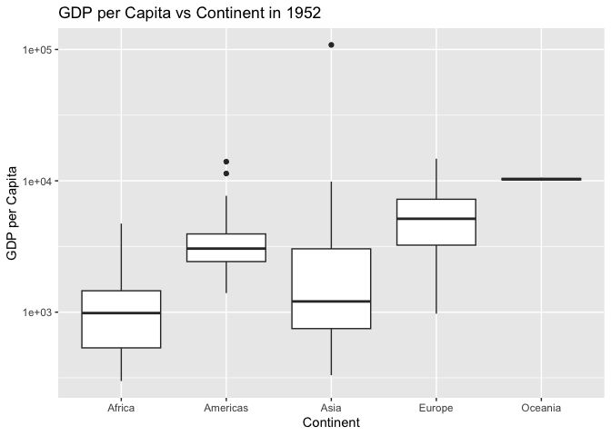
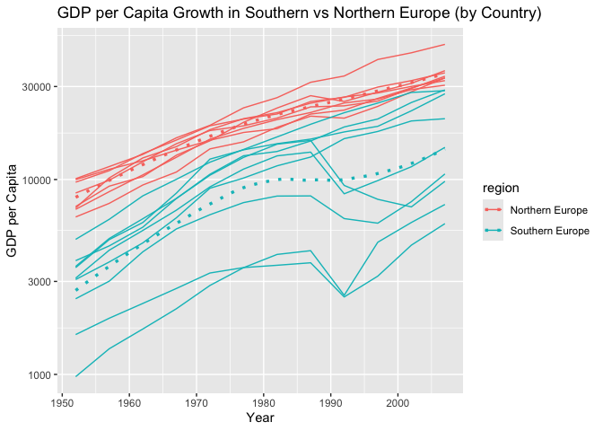

Gapminder
================
Aidan Schneider
03-02-25

- [Grading Rubric](#grading-rubric)
  - [Individual](#individual)
  - [Submission](#submission)
- [Guided EDA](#guided-eda)
  - [**q0** Perform your “first checks” on the dataset. What variables
    are in
    this](#q0-perform-your-first-checks-on-the-dataset-what-variables-are-in-this)
  - [**q1** Determine the most and least recent years in the `gapminder`
    dataset.](#q1-determine-the-most-and-least-recent-years-in-the-gapminder-dataset)
  - [**q2** Filter on years matching `year_min`, and make a plot of the
    GDP per capita against continent. Choose an appropriate `geom_` to
    visualize the data. What observations can you
    make?](#q2-filter-on-years-matching-year_min-and-make-a-plot-of-the-gdp-per-capita-against-continent-choose-an-appropriate-geom_-to-visualize-the-data-what-observations-can-you-make)
  - [**q3** You should have found *at least* three outliers in q2 (but
    possibly many more!). Identify those outliers (figure out which
    countries they
    are).](#q3-you-should-have-found-at-least-three-outliers-in-q2-but-possibly-many-more-identify-those-outliers-figure-out-which-countries-they-are)
  - [**q4** Create a plot similar to yours from q2 studying both
    `year_min` and `year_max`. Find a way to highlight the outliers from
    q3 on your plot *in a way that lets you identify which country is
    which*. Compare the patterns between `year_min` and
    `year_max`.](#q4-create-a-plot-similar-to-yours-from-q2-studying-both-year_min-and-year_max-find-a-way-to-highlight-the-outliers-from-q3-on-your-plot-in-a-way-that-lets-you-identify-which-country-is-which-compare-the-patterns-between-year_min-and-year_max)
- [Your Own EDA](#your-own-eda)
  - [**q5** Create *at least* three new figures below. With each figure,
    try to pose new questions about the
    data.](#q5-create-at-least-three-new-figures-below-with-each-figure-try-to-pose-new-questions-about-the-data)

*Purpose*: Learning to do EDA well takes practice! In this challenge
you’ll further practice EDA by first completing a guided exploration,
then by conducting your own investigation. This challenge will also give
you a chance to use the wide variety of visual tools we’ve been
learning.

<!-- include-rubric -->

# Grading Rubric

<!-- -------------------------------------------------- -->

Unlike exercises, **challenges will be graded**. The following rubrics
define how you will be graded, both on an individual and team basis.

## Individual

<!-- ------------------------- -->

| Category | Needs Improvement | Satisfactory |
|----|----|----|
| Effort | Some task **q**’s left unattempted | All task **q**’s attempted |
| Observed | Did not document observations, or observations incorrect | Documented correct observations based on analysis |
| Supported | Some observations not clearly supported by analysis | All observations clearly supported by analysis (table, graph, etc.) |
| Assessed | Observations include claims not supported by the data, or reflect a level of certainty not warranted by the data | Observations are appropriately qualified by the quality & relevance of the data and (in)conclusiveness of the support |
| Specified | Uses the phrase “more data are necessary” without clarification | Any statement that “more data are necessary” specifies which *specific* data are needed to answer what *specific* question |
| Code Styled | Violations of the [style guide](https://style.tidyverse.org/) hinder readability | Code sufficiently close to the [style guide](https://style.tidyverse.org/) |

## Submission

<!-- ------------------------- -->

Make sure to commit both the challenge report (`report.md` file) and
supporting files (`report_files/` folder) when you are done! Then submit
a link to Canvas. **Your Challenge submission is not complete without
all files uploaded to GitHub.**

``` r
library(tidyverse)
```

    ## ── Attaching core tidyverse packages ──────────────────────── tidyverse 2.0.0 ──
    ## ✔ dplyr     1.1.4     ✔ readr     2.1.5
    ## ✔ forcats   1.0.0     ✔ stringr   1.5.1
    ## ✔ ggplot2   3.5.1     ✔ tibble    3.2.1
    ## ✔ lubridate 1.9.4     ✔ tidyr     1.3.1
    ## ✔ purrr     1.0.2     
    ## ── Conflicts ────────────────────────────────────────── tidyverse_conflicts() ──
    ## ✖ dplyr::filter() masks stats::filter()
    ## ✖ dplyr::lag()    masks stats::lag()
    ## ℹ Use the conflicted package (<http://conflicted.r-lib.org/>) to force all conflicts to become errors

``` r
library(gapminder)
```

*Background*: [Gapminder](https://www.gapminder.org/about-gapminder/) is
an independent organization that seeks to educate people about the state
of the world. They seek to counteract the worldview constructed by a
hype-driven media cycle, and promote a “fact-based worldview” by
focusing on data. The dataset we’ll study in this challenge is from
Gapminder.

# Guided EDA

<!-- -------------------------------------------------- -->

First, we’ll go through a round of *guided EDA*. Try to pay attention to
the high-level process we’re going through—after this guided round
you’ll be responsible for doing another cycle of EDA on your own!

### **q0** Perform your “first checks” on the dataset. What variables are in this

dataset?

``` r
## TASK: Do your "first checks" here!

gapminder %>% 
  glimpse() %>% 
  summary()
```

    ## Rows: 1,704
    ## Columns: 6
    ## $ country   <fct> "Afghanistan", "Afghanistan", "Afghanistan", "Afghanistan", …
    ## $ continent <fct> Asia, Asia, Asia, Asia, Asia, Asia, Asia, Asia, Asia, Asia, …
    ## $ year      <int> 1952, 1957, 1962, 1967, 1972, 1977, 1982, 1987, 1992, 1997, …
    ## $ lifeExp   <dbl> 28.801, 30.332, 31.997, 34.020, 36.088, 38.438, 39.854, 40.8…
    ## $ pop       <int> 8425333, 9240934, 10267083, 11537966, 13079460, 14880372, 12…
    ## $ gdpPercap <dbl> 779.4453, 820.8530, 853.1007, 836.1971, 739.9811, 786.1134, …

    ##         country        continent        year         lifeExp     
    ##  Afghanistan:  12   Africa  :624   Min.   :1952   Min.   :23.60  
    ##  Albania    :  12   Americas:300   1st Qu.:1966   1st Qu.:48.20  
    ##  Algeria    :  12   Asia    :396   Median :1980   Median :60.71  
    ##  Angola     :  12   Europe  :360   Mean   :1980   Mean   :59.47  
    ##  Argentina  :  12   Oceania : 24   3rd Qu.:1993   3rd Qu.:70.85  
    ##  Australia  :  12                  Max.   :2007   Max.   :82.60  
    ##  (Other)    :1632                                                
    ##       pop              gdpPercap       
    ##  Min.   :6.001e+04   Min.   :   241.2  
    ##  1st Qu.:2.794e+06   1st Qu.:  1202.1  
    ##  Median :7.024e+06   Median :  3531.8  
    ##  Mean   :2.960e+07   Mean   :  7215.3  
    ##  3rd Qu.:1.959e+07   3rd Qu.:  9325.5  
    ##  Max.   :1.319e+09   Max.   :113523.1  
    ## 

**Observations**:

- Write all variable names here
- country: country of interest
- continent: continent on which country is located
- year: year in which the corresponding data has been collected
- lifeExp: life expectancy for a country in a specific year
- pop: population of the country in a specific year
- gdpPercap: gdp per capita of a country in a specific year

### **q1** Determine the most and least recent years in the `gapminder` dataset.

*Hint*: Use the `pull()` function to get a vector out of a tibble.
(Rather than the `$` notation of base R.)

``` r
## TASK: Find the largest and smallest values of `year` in `gapminder`

year_max <-
  gapminder %>% 
  pull(year) %>% 
  max()

year_min <-
  gapminder %>% 
  pull(year) %>% 
  min()
```

Use the following test to check your work.

``` r
## NOTE: No need to change this
assertthat::assert_that(year_max %% 7 == 5)
```

    ## [1] TRUE

``` r
assertthat::assert_that(year_max %% 3 == 0)
```

    ## [1] TRUE

``` r
assertthat::assert_that(year_min %% 7 == 6)
```

    ## [1] TRUE

``` r
assertthat::assert_that(year_min %% 3 == 2)
```

    ## [1] TRUE

``` r
if (is_tibble(year_max)) {
  print("year_max is a tibble; try using `pull()` to get a vector")
  assertthat::assert_that(False)
}

print("Nice!")
```

    ## [1] "Nice!"

### **q2** Filter on years matching `year_min`, and make a plot of the GDP per capita against continent. Choose an appropriate `geom_` to visualize the data. What observations can you make?

You may encounter difficulties in visualizing these data; if so document
your challenges and attempt to produce the most informative visual you
can.

``` r
## TASK: Create a visual of gdpPercap vs continent

df_q2 <- gapminder
df_q2 %>% 
  filter(year == year_min) %>%  
  group_by(continent) %>% 
  ggplot(aes(x = continent, y = gdpPercap)) +
  geom_boxplot() +
  labs(title = "GDP per Capita vs Continent in 1952",
       x = "Continent",
       y = "GDP per Capita")
```

<!-- -->

**Observations**:

- Write your observations here

I chose to make a box plot to compare the range of GDP Per Capita of
each continent. The above plot shows that the 1st-3rd quartiles of each
continent’s GDP per Capita are all relatively the same, with a few
outliers in the Americas and Asia boxplots.

**Difficulties & Approaches**:

- Write your challenges and your approach to solving them

The greatest challenge was deciding what plot would best represent this
data. I initially chose a bar plot, but found that the bar plot summed
the GDP per Capita’s of each country in each continent by stacking,
which wasn’t a good comparison method for making our analysis. I then
opted to use a boxplot, which more effectively showed the spread of GDP
per Capita’s of each of the countries in each of the continents.

### **q3** You should have found *at least* three outliers in q2 (but possibly many more!). Identify those outliers (figure out which countries they are).

``` r
## TASK: Identify the outliers from q2

df_q3 <- df_q2 %>%
  filter(year == year_min) %>%
  summarise(
    Q1 = quantile(gdpPercap, 0.25),  
    Q3 = quantile(gdpPercap, 0.75), 
    IQR = IQR(gdpPercap)
  ) %>%
  mutate(
    lower_bound = Q1 - 1.5 * IQR,
    upper_bound = Q3 + 1.5 * IQR   
  ) %>%
  right_join(df_q2 %>% filter(year == year_min), by = character(0)) %>%  
  filter(gdpPercap < lower_bound | gdpPercap > upper_bound)  
```

    ## Warning: Using `by = character()` to perform a cross join was deprecated in dplyr 1.1.0.
    ## ℹ Please use `cross_join()` instead.
    ## This warning is displayed once every 8 hours.
    ## Call `lifecycle::last_lifecycle_warnings()` to see where this warning was
    ## generated.

``` r
df_q3
```

    ## # A tibble: 12 × 11
    ##       Q1    Q3   IQR lower_bound upper_bound country     continent  year lifeExp
    ##    <dbl> <dbl> <dbl>       <dbl>       <dbl> <fct>       <fct>     <int>   <dbl>
    ##  1  865. 3913. 3049.      -3708.       8487. Australia   Oceania    1952    69.1
    ##  2  865. 3913. 3049.      -3708.       8487. Bahrain     Asia       1952    50.9
    ##  3  865. 3913. 3049.      -3708.       8487. Canada      Americas   1952    68.8
    ##  4  865. 3913. 3049.      -3708.       8487. Denmark     Europe     1952    70.8
    ##  5  865. 3913. 3049.      -3708.       8487. Kuwait      Asia       1952    55.6
    ##  6  865. 3913. 3049.      -3708.       8487. Netherlands Europe     1952    72.1
    ##  7  865. 3913. 3049.      -3708.       8487. New Zealand Oceania    1952    69.4
    ##  8  865. 3913. 3049.      -3708.       8487. Norway      Europe     1952    72.7
    ##  9  865. 3913. 3049.      -3708.       8487. Sweden      Europe     1952    71.9
    ## 10  865. 3913. 3049.      -3708.       8487. Switzerland Europe     1952    69.6
    ## 11  865. 3913. 3049.      -3708.       8487. United Kin… Europe     1952    69.2
    ## 12  865. 3913. 3049.      -3708.       8487. United Sta… Americas   1952    68.4
    ## # ℹ 2 more variables: pop <int>, gdpPercap <dbl>

**Observations**:

- Identify the outlier countries from q2
  - The outlier countries from q2 are: Australia, Bahrain, Canada,
    Denmark, Kuwait, the Netherlands, New Zealand, Norway, Switzerland,
    the UK, and the US.

*Hint*: For the next task, it’s helpful to know a ggplot trick we’ll
learn in an upcoming exercise: You can use the `data` argument inside
any `geom_*` to modify the data that will be plotted *by that geom
only*. For instance, you can use this trick to filter a set of points to
label:

``` r
## NOTE: No need to edit, use ideas from this in q4 below
gapminder %>%
  filter(year == max(year)) %>%
  ggplot(aes(continent, lifeExp)) +
  geom_boxplot() +
  geom_point(
    data = . %>% filter(country %in% c("United Kingdom", "Japan", "Zambia")),
    mapping = aes(color = country),
    size = 2
  )
```

<!-- -->

### **q4** Create a plot similar to yours from q2 studying both `year_min` and `year_max`. Find a way to highlight the outliers from q3 on your plot *in a way that lets you identify which country is which*. Compare the patterns between `year_min` and `year_max`.

*Hint*: We’ve learned a lot of different ways to show multiple
variables; think about using different aesthetics or facets.

``` r
## TASK: Create a visual of gdpPercap vs continent


gapminder %>% 
  filter(year %in% c(year_min, year_max)) %>% 
  group_by(continent) %>% 
  ggplot(aes(continent, gdpPercap)) +
  geom_boxplot(aes(fill = factor(year)), alpha = 0.6) +
  geom_point(data = . %>% filter(country %in% c("United Kingdom", "United States", "Australia", "Bahrain", "Canada", "Denmark", "Kuwait", "Netherlands", "New Zealand", "Norway", "Switzerland")), 
             aes(color = country), size = 2) + 
  facet_wrap(~ year) +
  labs(title = paste("GDP per Capita vs Year (", year_min, " and ", year_max, ")", sep = ""), x = "Year", y = "GDP per Capita")
```

<!-- -->

**Observations**:

- Write your observations here

- Most of the outliers’ GDP Per Capita are above the third quartile of
  their respective continents, the only exception being New Zealand

- Europe’s outliers (Denmark, Netherlands, Norway, Switzerland) have a
  larger gap between them and the 3rd quartile in 1952 than in 2007.
  This could be attributed to the democratization of Europe that occured
  in the 1990’s, causing Europe to overall become wealthier.

- Kuwait seems to be an extreme outlier in the 1950’s, which could be
  attributed to their prosperous shipping and ship-building industry at
  the time

# Your Own EDA

<!-- -------------------------------------------------- -->

Now it’s your turn! We just went through guided EDA considering the GDP
per capita at two time points. You can continue looking at outliers,
consider different years, repeat the exercise with `lifeExp`, consider
the relationship between variables, or something else entirely.

### **q5** Create *at least* three new figures below. With each figure, try to pose new questions about the data.

``` r
## TASK: Your first graph

gapminder %>%
  group_by(year, continent) %>%
  summarise(lifeExp_mean = mean(lifeExp, na.rm = TRUE)) %>%
  ggplot(aes(x = year, y = lifeExp_mean, color = continent)) +
  geom_line() +
  labs(
    title = "Mean Life Expectancy per Continent from 1952-2007",
    x = "Year (yr)",
    y = "Mean Life Expectancy (yr)")
```

    ## `summarise()` has grouped output by 'year'. You can override using the
    ## `.groups` argument.

<!-- -->

- (Your notes and observations here) Question: How has average Life
  Expectancy changed in each of the world’s continents from 1952 to
  2007?

Observations: - The plot above seems to suggest that the overall life
expectancy across the world has increased since 1952 - The plot’s for
each of the continents seem to have grown uniformly, but wealthier
continent (such as the Americas and Europe) have a greater average mean
life expectancy than poorer continents (such as Africa or Asia).

``` r
## TASK: Your second graph

gapminder %>%
  group_by(country, continent) %>% 
  summarise(gdpPercap_mean = mean(gdpPercap, na.rm = TRUE), lifeExp_mean = mean(lifeExp, na.rm = TRUE)) %>%    
  ggplot(aes(x = gdpPercap_mean, y = lifeExp_mean, color = continent)) +
  geom_point(aes(size = 3), alpha = 0.7) +  
  scale_x_log10() + 
  labs(
    title = "GDP per Capita vs Life Expectancy by Country",
    x = "GDP per Capita (Dollars, log scale)",
    y = "Life Expectancy (yr)"
  ) 
```

    ## `summarise()` has grouped output by 'country'. You can override using the
    ## `.groups` argument.

<!-- -->

- (Your notes and observations here) Question: How does GDP per Capita
  affect the life expectancy of a country?

Observations: - GDP per Capita has a great affect on the life expectancy
of a country - There is a positive correlation between gdp per capita
and life expectancy - Countries in Africa and Asia have on average lower
gdp per capita’s than countries in Europe and the Americas

``` r
## TASK: Your third graph

gapminder %>%
  ggplot(aes(x = pop, y = lifeExp, color = continent)) + 
  geom_point(alpha = 0.7) + 
  scale_x_log10() + 
  facet_wrap(~ continent) + 
  labs(
    title = "Population Growth vs Life Expectancy by Continent",
    x = "Population (Log Scale)",
    y = "Life Expectancy (yr)"
  )
```

<!-- -->

- (Your notes and observations here) Question: How does the growth of
  population influence Life Expectancy?

Observations: - The plots above show that there is a general positive
correlation between an increase in population and life expectancy -
There are a few clusters of points in Africa that do not follow this
pattern, which could be due to overpopulation or an extreme event such
as war and/or famine.
