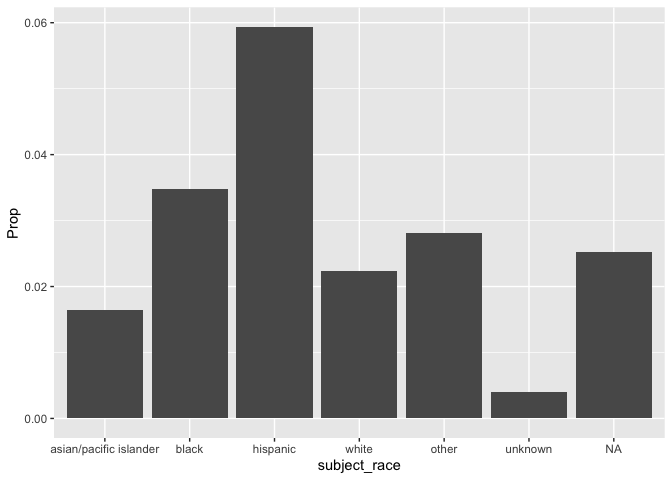
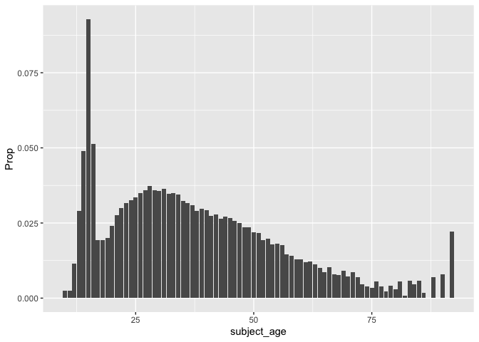
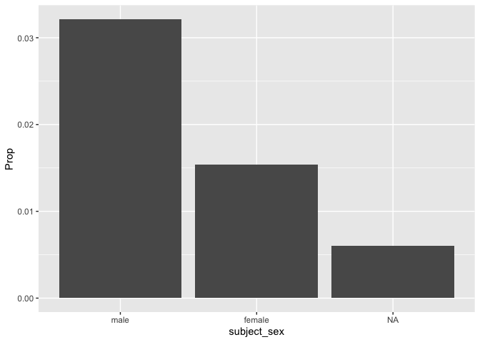

Massachusetts Highway Stops
================
Aidan Schneider
2025-04-26

- [Grading Rubric](#grading-rubric)
  - [Individual](#individual)
  - [Submission](#submission)
- [Setup](#setup)
  - [**q1** Go to the Stanford Open Policing Project page and download
    the Massachusetts State Police records in `Rds` format. Move the
    data to your `data` folder and match the `filename` to load the
    data.](#q1-go-to-the-stanford-open-policing-project-page-and-download-the-massachusetts-state-police-records-in-rds-format-move-the-data-to-your-data-folder-and-match-the-filename-to-load-the-data)
- [EDA](#eda)
  - [**q2** Do your “first checks” on the dataset. What are the basic
    facts about this
    dataset?](#q2-do-your-first-checks-on-the-dataset-what-are-the-basic-facts-about-this-dataset)
  - [**q3** Check the set of factor levels for `subject_race` and
    `raw_Race`. What do you note about overlap / difference between the
    two
    sets?](#q3-check-the-set-of-factor-levels-for-subject_race-and-raw_race-what-do-you-note-about-overlap--difference-between-the-two-sets)
  - [**q4** Check whether `subject_race` and `raw_Race` match for a
    large fraction of cases. Which of the two hypotheses above is most
    likely, based on your
    results?](#q4-check-whether-subject_race-and-raw_race-match-for-a-large-fraction-of-cases-which-of-the-two-hypotheses-above-is-most-likely-based-on-your-results)
  - [Vis](#vis)
    - [**q5** Compare the *arrest rate*—the fraction of total cases in
      which the subject was arrested—across different factors. Create as
      many visuals (or tables) as you need, but make sure to check the
      trends across all of the `subject` variables. Answer the questions
      under *observations*
      below.](#q5-compare-the-arrest-ratethe-fraction-of-total-cases-in-which-the-subject-was-arrestedacross-different-factors-create-as-many-visuals-or-tables-as-you-need-but-make-sure-to-check-the-trends-across-all-of-the-subject-variables-answer-the-questions-under-observations-below)
- [Modeling](#modeling)
  - [**q6** Run the following code and interpret the regression
    coefficients. Answer the the questions under *observations*
    below.](#q6-run-the-following-code-and-interpret-the-regression-coefficients-answer-the-the-questions-under-observations-below)
  - [**q7** Re-fit the logistic regression from q6 setting `"white"` as
    the reference level for `subject_race`. Interpret the the model
    terms and answer the questions
    below.](#q7-re-fit-the-logistic-regression-from-q6-setting-white-as-the-reference-level-for-subject_race-interpret-the-the-model-terms-and-answer-the-questions-below)
  - [**q8** Re-fit the model using a factor indicating the presence of
    contraband in the subject’s vehicle. Answer the questions under
    *observations*
    below.](#q8-re-fit-the-model-using-a-factor-indicating-the-presence-of-contraband-in-the-subjects-vehicle-answer-the-questions-under-observations-below)
  - [**q9** Go deeper: Pose at least one more question about the data
    and fit at least one more model in support of answering that
    question.](#q9-go-deeper-pose-at-least-one-more-question-about-the-data-and-fit-at-least-one-more-model-in-support-of-answering-that-question)
  - [Further Reading](#further-reading)

*Purpose*: In this last challenge we’ll focus on using logistic
regression to study a large, complicated dataset. Interpreting the
results of a model can be challenging—both in terms of the statistics
and the real-world reasoning—so we’ll get some practice in this
challenge.

<!-- include-rubric -->

# Grading Rubric

<!-- -------------------------------------------------- -->

Unlike exercises, **challenges will be graded**. The following rubrics
define how you will be graded, both on an individual and team basis.

## Individual

<!-- ------------------------- -->

| Category | Needs Improvement | Satisfactory |
|----|----|----|
| Effort | Some task **q**’s left unattempted | All task **q**’s attempted |
| Observed | Did not document observations, or observations incorrect | Documented correct observations based on analysis |
| Supported | Some observations not clearly supported by analysis | All observations clearly supported by analysis (table, graph, etc.) |
| Assessed | Observations include claims not supported by the data, or reflect a level of certainty not warranted by the data | Observations are appropriately qualified by the quality & relevance of the data and (in)conclusiveness of the support |
| Specified | Uses the phrase “more data are necessary” without clarification | Any statement that “more data are necessary” specifies which *specific* data are needed to answer what *specific* question |
| Code Styled | Violations of the [style guide](https://style.tidyverse.org/) hinder readability | Code sufficiently close to the [style guide](https://style.tidyverse.org/) |

## Submission

<!-- ------------------------- -->

Make sure to commit both the challenge report (`report.md` file) and
supporting files (`report_files/` folder) when you are done! Then submit
a link to Canvas. **Your Challenge submission is not complete without
all files uploaded to GitHub.**

*Background*: We’ll study data from the [Stanford Open Policing
Project](https://openpolicing.stanford.edu/data/), specifically their
dataset on Massachusetts State Patrol police stops.

``` r
library(tidyverse)
```

    ## ── Attaching core tidyverse packages ──────────────────────── tidyverse 2.0.0 ──
    ## ✔ dplyr     1.1.4     ✔ readr     2.1.5
    ## ✔ forcats   1.0.0     ✔ stringr   1.5.1
    ## ✔ ggplot2   3.5.1     ✔ tibble    3.2.1
    ## ✔ lubridate 1.9.4     ✔ tidyr     1.3.1
    ## ✔ purrr     1.0.2     
    ## ── Conflicts ────────────────────────────────────────── tidyverse_conflicts() ──
    ## ✖ dplyr::filter() masks stats::filter()
    ## ✖ dplyr::lag()    masks stats::lag()
    ## ℹ Use the conflicted package (<http://conflicted.r-lib.org/>) to force all conflicts to become errors

``` r
library(broom)
```

# Setup

<!-- -------------------------------------------------- -->

### **q1** Go to the [Stanford Open Policing Project](https://openpolicing.stanford.edu/data/) page and download the Massachusetts State Police records in `Rds` format. Move the data to your `data` folder and match the `filename` to load the data.

*Note*: An `Rds` file is an R-specific file format. The function
`readRDS` will read these files.

``` r
## TODO: Download the data, move to your data folder, and load it
filename <- "./data/yg821jf8611_ma_statewide_2020_04_01.rds"
df_data <- readRDS(filename)
```

# EDA

<!-- -------------------------------------------------- -->

### **q2** Do your “first checks” on the dataset. What are the basic facts about this dataset?

``` r
df_data %>% 
  glimpse()
```

    ## Rows: 3,416,238
    ## Columns: 24
    ## $ raw_row_number             <chr> "1", "2", "3", "4", "5", "6", "7", "8", "9"…
    ## $ date                       <date> 2007-06-06, 2007-06-07, 2007-06-07, 2007-0…
    ## $ location                   <chr> "MIDDLEBOROUGH", "SEEKONK", "MEDFORD", "MED…
    ## $ county_name                <chr> "Plymouth County", "Bristol County", "Middl…
    ## $ subject_age                <int> 33, 36, 56, 37, 22, 34, 54, 31, 21, 56, 56,…
    ## $ subject_race               <fct> white, white, white, white, hispanic, white…
    ## $ subject_sex                <fct> male, male, female, male, female, male, mal…
    ## $ type                       <fct> vehicular, vehicular, vehicular, vehicular,…
    ## $ arrest_made                <lgl> FALSE, FALSE, FALSE, FALSE, FALSE, FALSE, F…
    ## $ citation_issued            <lgl> TRUE, FALSE, FALSE, FALSE, TRUE, TRUE, TRUE…
    ## $ warning_issued             <lgl> FALSE, TRUE, TRUE, TRUE, FALSE, FALSE, FALS…
    ## $ outcome                    <fct> citation, warning, warning, warning, citati…
    ## $ contraband_found           <lgl> NA, FALSE, NA, NA, NA, NA, NA, NA, NA, NA, …
    ## $ contraband_drugs           <lgl> NA, FALSE, NA, NA, NA, NA, NA, NA, NA, NA, …
    ## $ contraband_weapons         <lgl> NA, FALSE, NA, NA, NA, NA, NA, NA, NA, NA, …
    ## $ contraband_alcohol         <lgl> FALSE, FALSE, FALSE, FALSE, FALSE, FALSE, F…
    ## $ contraband_other           <lgl> NA, FALSE, NA, NA, NA, NA, NA, NA, NA, NA, …
    ## $ frisk_performed            <lgl> NA, FALSE, NA, NA, NA, NA, NA, NA, NA, NA, …
    ## $ search_conducted           <lgl> FALSE, TRUE, FALSE, FALSE, FALSE, FALSE, FA…
    ## $ search_basis               <fct> NA, other, NA, NA, NA, NA, NA, NA, NA, NA, …
    ## $ reason_for_stop            <chr> "Speed", NA, NA, NA, NA, "Speed", NA, NA, N…
    ## $ vehicle_type               <chr> "Passenger", "Commercial", "Passenger", "Co…
    ## $ vehicle_registration_state <fct> MA, MA, MA, MA, MA, MA, MA, MA, MA, MA, MA,…
    ## $ raw_Race                   <chr> "White", "White", "White", "White", "Hispan…

**Observations**:

- What are the basic facts about this dataset?
- The dataset is about police reports of criminal activity
- Most of the reported criminal activity has to do with alchohol, drugs,
  weaponry, and vehicles
- Therefore I think this dataset deals with traffic stops and stats
  about occurences at these traffic stops
- The dataset spans from 2007-2015
- The dataset includes the outcome of the incident and identifying info
  of the person stopped

Note that we have both a `subject_race` and `race_Raw` column. There are
a few possibilities as to what `race_Raw` represents:

- `race_Raw` could be the race of the police officer in the stop
- `race_Raw` could be an unprocessed version of `subject_race`

Let’s try to distinguish between these two possibilities.

### **q3** Check the set of factor levels for `subject_race` and `raw_Race`. What do you note about overlap / difference between the two sets?

``` r
## TODO: Determine the factor levels for subject_race and raw_Race
df_data %>% 
  mutate(raw_Race = as.factor(raw_Race)) %>% 
  pull(raw_Race) %>% 
  levels()
```

    ## [1] "A"                                            
    ## [2] "American Indian or Alaskan Native"            
    ## [3] "Asian or Pacific Islander"                    
    ## [4] "Black"                                        
    ## [5] "Hispanic"                                     
    ## [6] "Middle Eastern or East Indian (South Asian)"  
    ## [7] "None - for no operator present citations only"
    ## [8] "White"

``` r
df_data %>% 
  pull(subject_race) %>% 
  levels()
```

    ## [1] "asian/pacific islander" "black"                  "hispanic"              
    ## [4] "white"                  "other"                  "unknown"

``` r
max_date <- max(df_data$date, na.rm = TRUE)

max_date
```

    ## [1] "2015-12-31"

**Observations**:

- What are the unique values for `subject_race`?

- asian/pacific islander

- black

- hispanic

- white

- other

- What are the unique values for `raw_Race`?

- Asian or Pacific Islander

- Hispanic

- American Indian or Alaskan Native

- Black

- Middle Eastern or East Indian (South Asian)

- White

- None - for no operator present citations only

- What is the overlap between the two sets?

- Common unique values:

  - Asian/Pacific Islander
  - Black
  - Hispanic
  - White

- What is the difference between the two sets?

- One includes more ethnicities/races than the other

- one includes a None category

### **q4** Check whether `subject_race` and `raw_Race` match for a large fraction of cases. Which of the two hypotheses above is most likely, based on your results?

*Note*: Just to be clear, I’m *not* asking you to do a *statistical*
hypothesis test.

``` r
## TODO: Devise your own way to test the hypothesis posed above.
df_q4 <- df_data %>%
  mutate(case_insensitive_match = tolower(raw_Race) == tolower(subject_race)) %>% 
  count(case_insensitive_match) %>% 
  filter(!is.na(case_insensitive_match)) %>%
  mutate(ratio = n / sum(n))
  
df_q4
```

    ## # A tibble: 2 × 3
    ##   case_insensitive_match       n  ratio
    ##   <lgl>                    <int>  <dbl>
    ## 1 FALSE                   194867 0.0571
    ## 2 TRUE                   3219707 0.943

**Observations**

Between the two hypotheses:

- `race_Raw` could be the race of the police officer in the stop
- `race_Raw` could be an unprocessed version of `subject_race`

which is most plausible, based on your results?

- I believe race_Raw is the unprocessed version of subject_race, as
  there are a greater number of matches between the columns than there
  are differences
- The “False” or non-matching entries may have been initial loggings of
  subject race that were later revised

## Vis

<!-- ------------------------- -->

### **q5** Compare the *arrest rate*—the fraction of total cases in which the subject was arrested—across different factors. Create as many visuals (or tables) as you need, but make sure to check the trends across all of the `subject` variables. Answer the questions under *observations* below.

(Note: Create as many chunks and visuals as you need)

``` r
df_q51 <- df_data %>% 
  group_by(subject_race, arrest_made) %>%
  summarise(n = n()) %>%
  mutate(
    Total = sum(n),
    Prop = n / Total
  ) %>%
  filter(arrest_made == TRUE) %>% 
  ungroup()
```

    ## `summarise()` has grouped output by 'subject_race'. You can override using the
    ## `.groups` argument.

``` r
df_q51 %>% 
  ggplot(aes(x = subject_race, y = Prop)) +
  geom_col()
```

<!-- -->

``` r
df_q52 <- df_data %>% 
  group_by(subject_age, arrest_made) %>%
  summarise(n = n()) %>%
  mutate(
    Total = sum(n),
    Prop = n / Total
  ) %>%
  filter(arrest_made == TRUE) %>% 
  ungroup()
```

    ## `summarise()` has grouped output by 'subject_age'. You can override using the
    ## `.groups` argument.

``` r
df_q52 %>% 
  ggplot(aes(x = subject_age,  y = Prop)) +
  geom_col()
```

    ## Warning: Removed 1 row containing missing values or values outside the scale range
    ## (`geom_col()`).

<!-- -->

``` r
df_q53 <- df_data %>% 
  group_by(subject_sex, arrest_made) %>%
  summarise(n = n()) %>%
  mutate(
    Total = sum(n),
    Prop = n / Total
  ) %>%
  filter(arrest_made == TRUE) %>% 
  ungroup()
```

    ## `summarise()` has grouped output by 'subject_sex'. You can override using the
    ## `.groups` argument.

``` r
df_q53 %>% 
  ggplot(aes(x = subject_sex,  y = Prop)) +
  geom_col()
```

<!-- -->

**Observations**:

- How does `arrest_rate` tend to vary with `subject_age`?
  - as the age of the subject increases, the arrest rate decreases
- How does `arrest_rate` tend to vary with `subject_sex`?
  - the proportion of arrests made is higher for males than it is for
    females
  - this means that males have a higher rate of arrests than females
- How does `arrest_rate` tend to vary with `subject_race`?
  - The race with the highest rate of arrest was hispanics
  - The race with the lowest rate of arrests were asian/pacific
    islanders

# Modeling

<!-- -------------------------------------------------- -->

We’re going to use a model to study the relationship between `subject`
factors and arrest rate, but first we need to understand a bit more
about *dummy variables*

### **q6** Run the following code and interpret the regression coefficients. Answer the the questions under *observations* below.

``` r
## NOTE: No need to edit; inspect the estimated model terms.
fit_q6 <-
  glm(
    formula = arrest_made ~ subject_age + subject_race + subject_sex,
    data = df_data %>%
      filter(
        !is.na(arrest_made),
        subject_race %in% c("white", "black", "hispanic")
      ),
    family = "binomial"
  )

fit_q6 %>% tidy()
```

    ## # A tibble: 5 × 5
    ##   term                 estimate std.error statistic   p.value
    ##   <chr>                   <dbl>     <dbl>     <dbl>     <dbl>
    ## 1 (Intercept)           -2.67    0.0132      -202.  0        
    ## 2 subject_age           -0.0142  0.000280     -50.5 0        
    ## 3 subject_racehispanic   0.513   0.0119        43.3 0        
    ## 4 subject_racewhite     -0.380   0.0103       -37.0 3.12e-299
    ## 5 subject_sexfemale     -0.755   0.00910      -83.0 0

**Observations**:

- Which `subject_race` levels are included in fitting the model?
  - races with levels are white, black, and hispanic
- Which `subject_race` levels have terms in the model?
  - the races with terms in the model are white and hispanic

You should find that each factor in the model has a level *missing* in
its set of terms. This is because R represents factors against a
*reference level*: The model treats one factor level as “default”, and
each factor model term represents a change from that “default” behavior.
For instance, the model above treats `subject_sex==male` as the
reference level, so the `subject_sexfemale` term represents the *change
in probability* of arrest due to a person being female (rather than
male).

The this reference level approach to coding factors is necessary for
[technical
reasons](https://www.andrew.cmu.edu/user/achoulde/94842/lectures/lecture10/lecture10-94842.html#why-is-one-of-the-levels-missing-in-the-regression),
but it complicates interpreting the model results. For instance; if we
want to compare two levels, neither of which are the reference level, we
have to consider the difference in their model coefficients. But if we
want to compare all levels against one “baseline” level, then we can
relevel the data to facilitate this comparison.

By default `glm` uses the first factor level present as the reference
level. Therefore we can use
`mutate(factor = fct_relevel(factor, "desired_level"))` to set our
`"desired_level"` as the reference factor.

### **q7** Re-fit the logistic regression from q6 setting `"white"` as the reference level for `subject_race`. Interpret the the model terms and answer the questions below.

``` r
## TODO: Re-fit the logistic regression, but set "white" as the reference
## level for subject_race
df_data <- df_data %>%
  mutate(subject_race = relevel(factor(subject_race), ref = "white"))

# Fit logistic regression model
fit_q7 <- glm(
  formula = arrest_made ~ subject_age + subject_race + subject_sex,
  data = df_data %>% filter(!is.na(arrest_made), subject_race %in% c("white", "black", "hispanic")),
  family = "binomial"
)

# Get tidy summary of the model
fit_q7 %>% tidy()
```

    ## # A tibble: 5 × 5
    ##   term                 estimate std.error statistic   p.value
    ##   <chr>                   <dbl>     <dbl>     <dbl>     <dbl>
    ## 1 (Intercept)           -3.05    0.0109      -279.  0        
    ## 2 subject_age           -0.0142  0.000280     -50.5 0        
    ## 3 subject_raceblack      0.380   0.0103        37.0 3.12e-299
    ## 4 subject_racehispanic   0.893   0.00859      104.  0        
    ## 5 subject_sexfemale     -0.755   0.00910      -83.0 0

**Observations**:

- Which `subject_race` level has the highest probability of being
  arrested, according to this model? Which has the lowest probability?
  - Highest probability: hispanics
  - Lowest probability: whites
- What could explain this difference in probabilities of arrest across
  race? List **multiple** possibilities.
  - racial discrimination
  - police targetting of specific races
  - racial bias in policing
  - socioeconomic factors relating to likelihood of arrest
  - deployment of police resources to minority communities
- Look at the set of variables in the dataset; do any of the columns
  relate to a potential explanation you listed?
  - the outcomes of the stops are related to this explanation
  - the citations/warnings columns also highlight this race-based
    difference in treatment

One way we can explain differential arrest rates is to include some
measure indicating the presence of an arrestable offense. We’ll do this
in a particular way in the next task.

### **q8** Re-fit the model using a factor indicating the presence of contraband in the subject’s vehicle. Answer the questions under *observations* below.

``` r
## TODO: Repeat the modeling above, but control for whether contraband was found
## during the police stop
df_data <- df_data %>%
  mutate(subject_race = relevel(factor(subject_race), ref = "white"))

# Fit logistic regression model
fit_q8 <- glm(
  formula = arrest_made ~ subject_age + subject_race + subject_sex + contraband_found,
  data = df_data %>% filter(!is.na(arrest_made), subject_race %in% c("white", "black", "hispanic")),
  family = "binomial"
)

fit_q8 %>% tidy()
```

    ## # A tibble: 6 × 5
    ##   term                 estimate std.error statistic   p.value
    ##   <chr>                   <dbl>     <dbl>     <dbl>     <dbl>
    ## 1 (Intercept)           -1.72    0.0339      -50.8  0        
    ## 2 subject_age            0.0225  0.000866     26.0  2.19e-149
    ## 3 subject_raceblack     -0.0511  0.0270       -1.90 5.80e-  2
    ## 4 subject_racehispanic   0.221   0.0237        9.31 1.32e- 20
    ## 5 subject_sexfemale     -0.306   0.0257      -11.9  1.06e- 32
    ## 6 contraband_foundTRUE   0.609   0.0192       31.7  4.29e-221

**Observations**:

- How does controlling for found contraband affect the `subject_race`
  terms in the model?
- The racial disparities drop significantly, with black and hispanics
  having smaller coefficients
- What does the *finding of contraband* tell us about the stop? What
  does it *not* tell us about the stop?
  - finding contraband increases the rate of arrest significantly
  - this does not tell us about why some arrest coefficients for some
    races (such as hispanics) are still relatively high, implicating
    other biases

### **q9** Go deeper: Pose at least one more question about the data and fit at least one more model in support of answering that question.

Question: What are the greatest indicating factors for a person being
searched in a traffic stop?

``` r
df_data <- df_data %>%
  mutate(subject_race = relevel(factor(subject_race), ref = "white"))

fit_q9 <- glm(
  formula = search_conducted ~ subject_age + subject_race + subject_sex + reason_for_stop,
  data = df_data %>% filter(!is.na(arrest_made), subject_race %in% c("white", "black", "hispanic")),
  family = "binomial"
)

fit_q9 %>% tidy()
```

    ## # A tibble: 11 × 5
    ##    term                                   estimate std.error statistic   p.value
    ##    <chr>                                     <dbl>     <dbl>     <dbl>     <dbl>
    ##  1 (Intercept)                             -2.70    0.0878     -30.7   2.31e-207
    ##  2 subject_age                             -0.0393  0.000746   -52.6   0        
    ##  3 subject_raceblack                        0.389   0.0221      17.6   1.05e- 69
    ##  4 subject_racehispanic                     0.510   0.0214      23.8   1.53e-125
    ##  5 subject_sexfemale                       -0.732   0.0203     -36.1   1.89e-285
    ##  6 reason_for_stopSeatBelt                  0.511   0.0849       6.02  1.72e-  9
    ##  7 reason_for_stopSeatBelt,ChildRest        0.0639  0.171        0.373 7.09e-  1
    ##  8 reason_for_stopSpeed                    -0.751   0.0846      -8.88  6.47e- 19
    ##  9 reason_for_stopSpeed,ChildRest          -0.425   0.184       -2.31  2.08e-  2
    ## 10 reason_for_stopSpeed,SeatBelt           -0.0545  0.0905      -0.602 5.47e-  1
    ## 11 reason_for_stopSpeed,SeatBelt,ChildRe…  -0.348   0.420       -0.829 4.07e-  1

**Observations**:

- The coefficients indicate that being stopped for speeding and being a
  female reduce the likelihood of being searched the most

- They also indicate that being being black or hispanic increase the
  likelihood of being searched

- Factors such as being stopped for seatbelt usage and age do not affect
  the likelihood of being searched

- Document your question and findings

## Further Reading

<!-- -------------------------------------------------- -->

- Stanford Open Policing Project
  [findings](https://openpolicing.stanford.edu/findings/).
